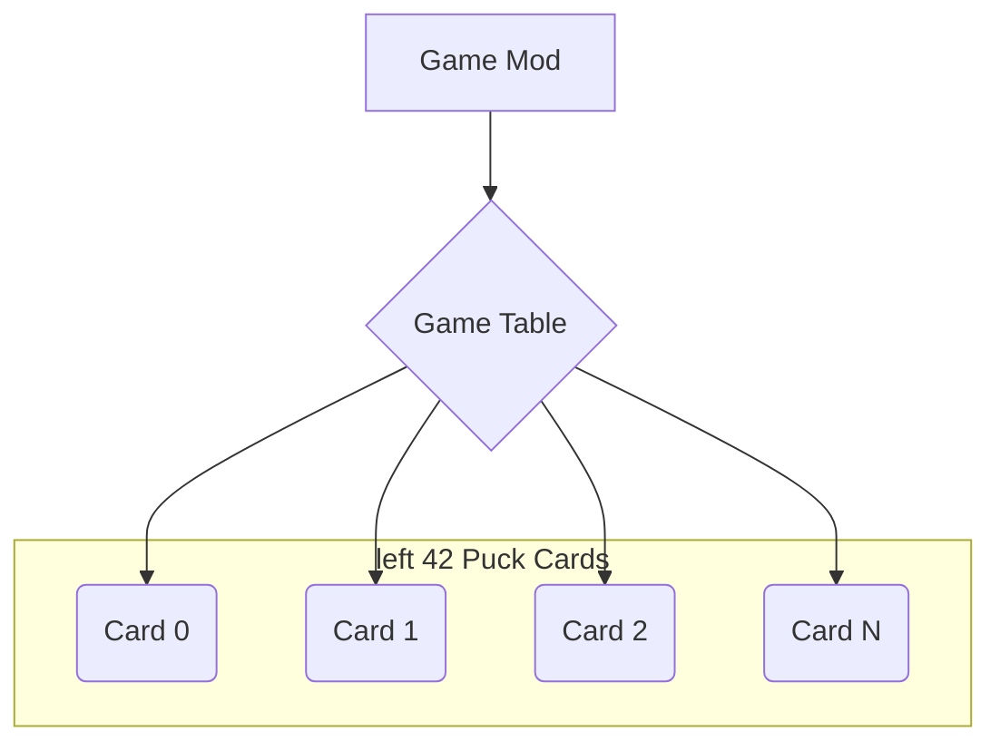
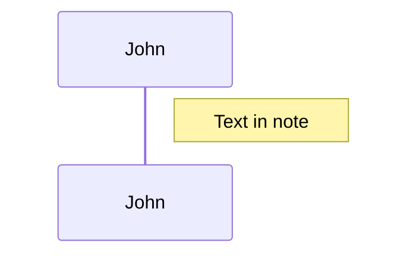

# My Solitaire rewrite

### flow chart

<!-- gfmd-start -->

```mermaid
graph TD
A[Game Mod] -->B{Game Table}
B -->C(Card 0)
B -->D(Card 1)
B -->E(Card 2)
B -->F(Card N)

subgraph left 42 Puck Cards
C
D
E
F
end
```

```mermaid
sequenceDiagram
    participant John
    Note right of John: Text in note
```
<!-- gfmd-end -->
