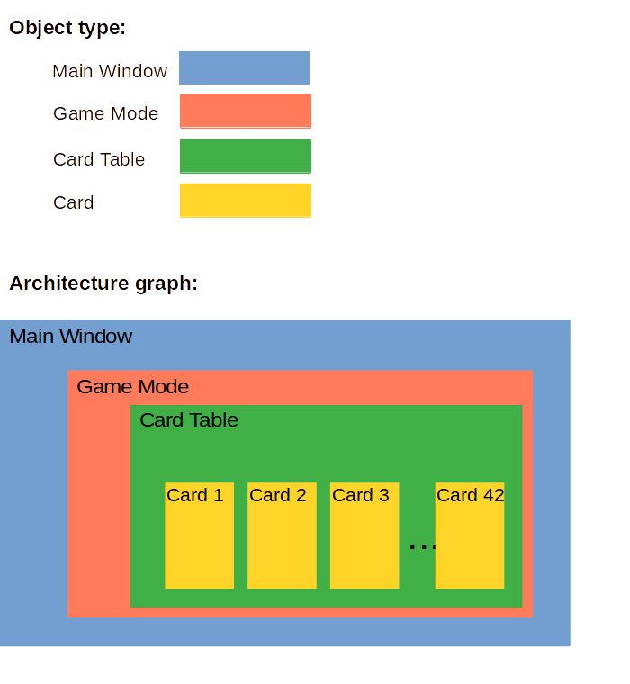

# My Solitaire rewrite
## Description

I done this college independent study when I’m freshman. It’s a Qt c++ program for solitaire poker game. 
Here is a timer in this program and it will tall you how many time you take for finish a game.

## Software Architecture graph

