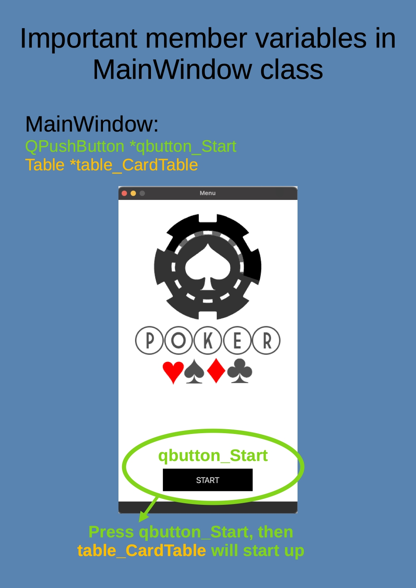

# My Solitaire rewrite
## Description

I done this college independent study when I’m freshman. It’s a Qt c++ program for solitaire poker game. 
I rewirte it on 2022 May. I try to make my code more readable, and make README. 
Hoping I can make my code easy to understand.

## Program introduction

