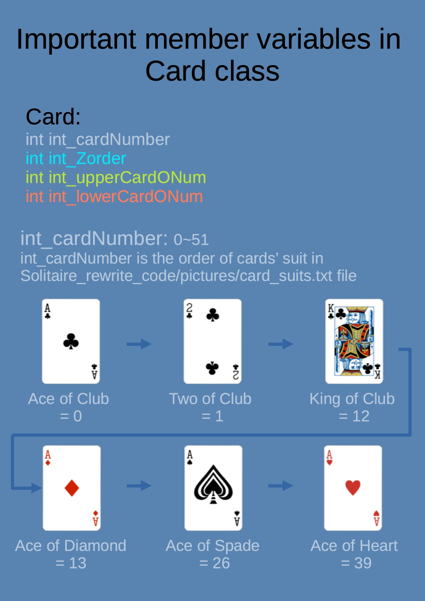
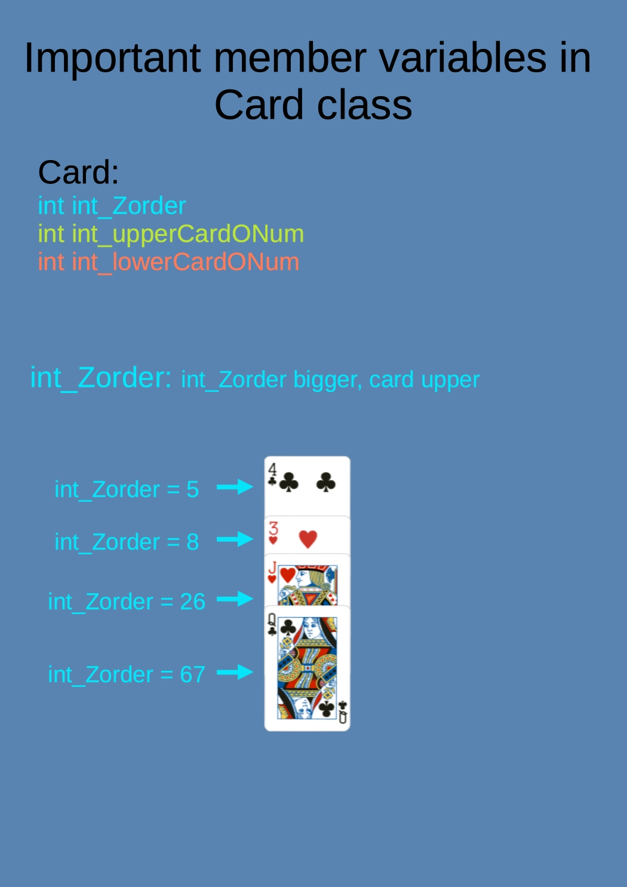

# My Solitaire rewrite
## Description

I done this college independent study when I’m freshman. It’s a Qt c++ program for solitaire poker game. 
I rewirte it on 2022 May. I try to make my code has more readability. Make functions high Cohesion, low Coupling.  
Hoping I can make my code easy to understand, and easy to debug.

## Development tool

Mac os, Qt Creator 6.2.4

## Program introduction

